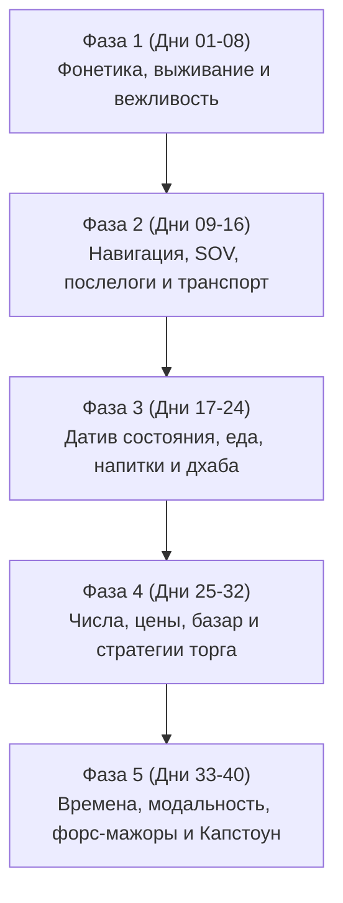

# Разговорный хинди за 40 дней для русскоязычных: Прикладное сопоставительное руководство

> **Курс**: С нуля до уверенного разговорного хинди за 40 дней (20 минут в день)  
> **Целевая аудитория**: Носители русского языка без предварительных знаний хинди или индийской письменности  
> **Методологическая основа**: Прикладная контрастивная лингвистика (русский <-> хинди) и индоевропейская этимология  
> **Направленность**: Исключительно устная речь, фонетическая точность, практическое выживание и свободная коммуникация в Индии  

---

## 1. Лингвистический фундамент курса

И хинди, и русский язык принадлежат к индоевропейской языковой семье (индоиранская и балто-славянская ветви). В отличие от англоязычных студентов, которые сталкиваются с непреодолимым когнитивным трением, носитель русского языка обладает врожденным языковым аппаратом, идеально приспособленным для усвоения хинди:

1. **Грамматический род**: В хинди 2 рода (мужской и женский). В русском 3 (мужской, женский, средний). Русскоязычный мозг уже умеет наделять неодушевленные предметы грамматическим родом и согласовывать с ними прилагательные и глаголы (*Большой стол* / *Большая комната* -> *Baṛā kamrā* / *Baṛī gāṛī*).
2. **Дативный субъект состояния (Experiencer Subject)**:
   - Английский язык: *I need water* (Я нуждаюсь в воде - номинативный субъект).
   - Русский язык: **Мне** [Датив] нужна вода.
   - Хинди: **Mujhē** [Датив] pānī chāhiye. (100% тождество мысли!).
   - То же самое с выражением симпатии: **Мне** нравится Индия = **Mujhē** Bhārat pasand hai.
3. **Иерархия вежливости (Вы / Āp)**: Русское различие между «Ты» и «Вы» напрямую проецируется на хинди *Tū / Tum / Āp*. По умолчанию студент использует форму вежливости *Āp* с окончанием глаголов на *-iye* (аналог русского *-ите*).
4. **Фонетический перенос**:
   - Чистый раскатистый альвеолярный [р] (र) идентичен русскому [р] (в отличие от английского скользящего /ɹ/).
   - Чистые монофтонги [а, и, у, э, о] без английских дифтонгов.

---

## 2. Фонетическая калибровка для русского речевого аппарата

```
+-----------------------------------------------------------------------------------------------------+
|                                АРТИКУЛЯЦИОННЫЕ ФОКУСЫ ХИНДИ                                         |
+------------------------------------+--------------------------------+-------------------------------+
| Категория звуков                   | Артикуляция в хинди            | Предостережение для русских  |
+------------------------------------+--------------------------------+-------------------------------+
| Дентальные (т, тх, д, дх)          | Лопатка языка на верхних зубах | Чистый звук без палатализации |
| Ретрофлексные (т͟, т͟х, д͟, д͟х, р͟) | Кончик языка загнут к нёбу     | ЗАПРЕЩЕНО заменять на 'ть/дь' |
| Придыхательные (кх, тх, пх, бх...) | Мощный легочный выброс воздуха | Тест с полоской бумаги (5 см) |
| Безударные гласные (аа, оо, ее)    | Сохраняют полную долготу       | ЗАПРЕЩЕНО редуцировать (аканье)|
| Носовые гласные (ааⁿ, ииⁿ, ууⁿ)   | Воздух через нос и рот         | Не прибавлять звук [н] в конце|
+------------------------------------+--------------------------------+-------------------------------+
```

### Стандарт тройной записи:
Каждое слово и фраза в курсе снабжены тремя слоями:
1. **Целевая русская фонетическая транскрипция**:
   - Удвоенные гласные (**аа, ии, уу**) для блокировки русского аканья.
   - Подчеркнутый курсив (**т͟, д͟, р͟**) для ретрофлексии (загиб языка назад).
   - Составные буквы (**кх, тх, пх, дх, бх**) для придыханий.
   - Надстрочный **ⁿ** для чистых носовых звуков.
2. **Международная транслитерация ISO 15919** (ā, ī, ū, ṭ, ḍ, ṛ, ś, ṣ, ñ, m̐).
3. **Каноническое деванагари** (для визуальной ориентации на экранах).

---

## 3. 20-минутный ежедневный когнитивный протокол

Каждое из 40 занятий рассчитано ровно на 20 минут высококонцентрированной практики без утомления:

* **00:00–04:00 (Фаза 1: Фонетическая калибровка и интервальный разогрев)**: Отработка сложных артикуляционных пар (зубной vs загнутый, придыхание, носовые звуки) и повторение конструкций предыдущих 24 и 72 часов.
* **04:00–11:00 (Фаза 2: Структурное ядро и русский когнитивный якорь)**: Введение грамматического механизма дня через прямую аналогию с русской грамматикой. Деванагари не учится — фокус на звучании и синтаксисе.
* **05:00–17:00 (Фаза 3: Чанкинг, подстановочные упражнения и речевой шейдоуинг)**: Повторение речевых блоков с мгновенной заменой лексических единиц в фиксированном шаблоне. Приучение к конечному положению глагола (SOV).
* **17:00–20:00 (Фаза 4: Ситуативная симуляция и микро-ролевая игра)**: Спонтанный диалог без перевода и без английского языка. Русская вводная ситуация -> мгновенная реакция на хинди.

---

## 4. Обзор 5 фаз 40-дневного курса



### Фаза 1: Фонетическая калибровка, формулы выживания и вежливые регистры (Дни 1–8)
- **День 1**: Артикуляция, жесты, Намастэ, частица вежливости Jī.
- **День 2**: Личность, имя, происхождение (из России), связка hū̃ (есмь).
- **День 3**: Вопрос о самочувствии, род прилагательных (-ī для женщин, -ē для мужчин).
- **День 4**: Да, нет, вежливый императив Māf kījiye (Извините) и Kōī bāt nahī̃ (Ничего страшного).
- **День 5**: Вопросительные слова на букву К и частица Kyā (русское «Ли»).
- **День 6**: Языковой ремонт: Mujhē Hindī nahī̃ ātī, Dhīrē bōliye (Говорите медленно).
- **День 7**: Пространственные указатели: Этот/Тот (Yeh/Voh), Здесь/Там (Yahā̃/Vahā̃).
- **День 8**: Итоговая симуляция заселения в отель и знакомства.

### Фаза 2: Пространственная навигация, локативы и логистика транспорта (Дни 9–16)
- **День 9**: Порядок слов SOV: направление ВСЕГДА перед глаголом (Sīdhē jāiye = Прямо поезжайте).
- **День 10**: Послелоги Mẽ (В) и Par (На/У): gāṛī mẽ, mēz par.
- **День 11**: Многофункциональный Sē: творительный (metro sē = на метро) и исходный (yahā̃ sē = отсюда).
- **День 12**: Поиск туалета (Washroom), банкомата (ATM) и аптеки (Pās mẽ).
- **День 13**: Вежливые директивы на -iye: Dījiye (дайте), Lījiye (возьмите), Āiye (войдите).
- **День 14**: Переговоры с такси: Bhaiyā, ... jānā hai, Mīṭar chalāo (Включи счетчик).
- **День 15**: Расчет времени в пути: Kitnā time lagēgā? (Сколько времени уйдет?).
- **День 16**: Итоговая транспортная симуляция от аэропорта до отеля.

### Фаза 3: Экспериенциальный дативный регистр, еда, напитки и потребности (Дни 17–24)
- **День 17**: Датив необходимости: Мне нужно = Mujhē chāhiye (вода, чай, счет, помощь).
- **День 18**: Квантификаторы и отказ: Thōṛā (чуть-чуть), Zyādā (много), Bas! (хватит!), Mujhē yeh nahī̃ chāhiye.
- **День 19**: Температура еды и безопасность: Garam (*gʷʰer- = жар), Ṭhaṇḍā, бутилированная вода Bisleri.
- **День 20**: Диета и специи: Main shākāhārī hū̃ (вегетарианка), Binā mirch kē (без перца), Tīkhā mat banāiye.
- **День 21**: Оценка еды: Khānā bahut svādishṭ hai! Соль (namak), сахар (cheenī).
- **День 22**: Датив предпочтения: Мне нравится = Mujhē pasand hai (индийская кухня, чай).
- **День 23**: Расчет: Bill lē āiye, Kitnā huā? (Сколько вышло?), Card chalēgā? (Карта пойдет?).
- **День 24**: Итоговая гастрономическая симуляция ужина в дхабе.

### Фаза 4: Коммерческие переговоры, числительные и динамика базара (Дни 25–32)
- **День 25**: Числительные 1–20 и индоевропейские когнаты (Do/два, Tīn/три, Pāñch/пять, Das/десять).
- **День 26**: Сотни и тысячи: Do sau (200), Pāñch sau (500), Hazār (1000).
- **День 27**: Запрос цены: Yeh kitnē kā hai? (Почём это?), Bahut mahangā hai! (Очень дорого!).
- **День 28**: Техники торга: Kam kījiye (скиньте), Sahī dām lagāiye (назовите честную цену).
- **День 29**: Качества товара: Baṛā/Baṛī (большой), Chhōṭā (маленький), Kharāb (бракованный).
- **День 30**: Альтернативы: Dūsrā dikhāiye (Покажите другой — когнат 'второй'), Raṅg (цвет).
- **День 31**: Сдача и упаковка: Khullē paisē (мелочь/сдача), Pack kar dījiye (упакуйте).
- **День 32**: Итоговая рыночная симуляция со сбиванием цены на 50%.

### Фаза 5: Аспектуальные времена, сложные ситуации и финальный иммерсив (Дни 33–40)
- **День 33**: Хабитуалис: регулярные привычки (Main Hindī boltī hū̃ = Я говорю на хинди).
- **День 34**: Длительный аспект: действие прямо сейчас (Main jā rahī hū̃, Main bas dēkh rahī hū̃ = Я просто смотрю).
- **День 35**: Модальность Saknā: Kyā main photo lē saktī hū̃? (Можно сфотографировать?).
- **День 36**: Планы и временные маркеры: Kal (завтра/вчера), Āj (сегодня), Hum phir milēṅgē (До свидания!).
- **День 37**: Здоровье: Mērī tabīyat kharāb hai (Мне нездоровится), Pēṭ dard (боль в животе), Doctor ko bulāiye.
- **День 38**: Социальный этикет: Mujhē Bhārat bahut pasand hai, Yahā̃ kē log bahut acchē haiñ.
- **День 39**: Форс-мажоры: Mērā bag khō gayā hai (Моя сумка потерялась), Kyā train late hai?
- **День 40**: Финальный 20-минутный иммерсивный супер-ролеплей (5 сцен без перевода).

---

## 5. Архитектура интерактивных упражнений для Duolingo-платформы

Все данные структурированы в формате JSON и готовы для рендеринга на веб-платформе. В каждом дне содержатся типы упражнений:

1. **`phonetic_discrimination`**: Распознавание минимальных пар звуков (дентальный vs ретрофлексный, придыхание).
2. **`word_reorder_sov`**: Интерактивная перестановка плашек со словами из русского порядка SVO в строгий порядок хинди SOV.
3. **`fill_in_blank`**: Подстановка недостающих послелогов (mẽ, par, sē, ko) или глагольных окончаний.
4. **`substitution_drill`**: Подстановочные упражнения на автоматизм грамматических матриц.
5. **`listen_and_repeat`**: Шейдоуинг-повторение за эталонным аудио с визуальным контролем русской транскрипции.
6. **`rapid_oral_challenge`**: Экстренный речевой таймер (3 секунды на ответ в стрессовой ситуации).
7. **`dialogue_roleplay`**: Пошаговый интерактивный диалог с виртуальным собеседником.
